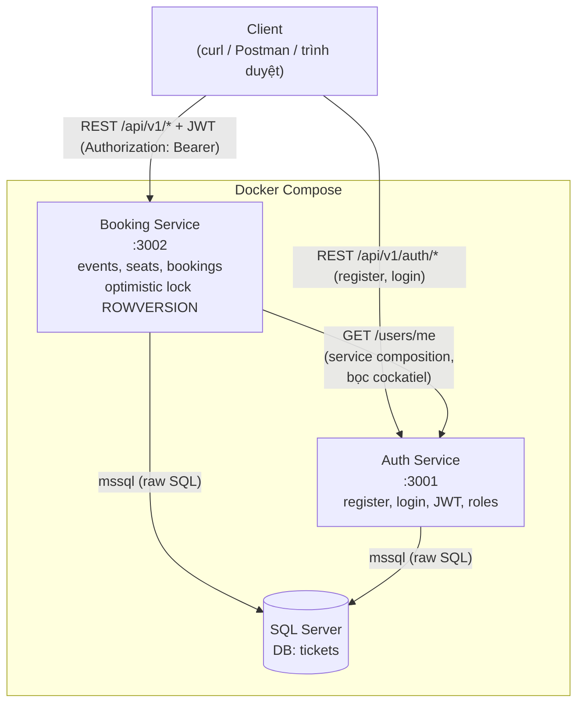
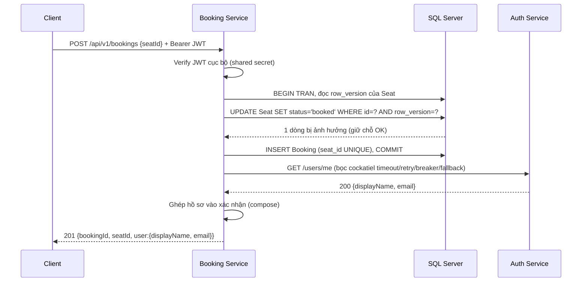

# 2. Kiến trúc hệ thống

Mục này mô tả kiến trúc của hệ thống đặt vé theo lăng kính hai chương Sommerville: kỹ nghệ phần mềm hướng dịch vụ (Service-Oriented Software Engineering, Ch.18) và kỹ nghệ phần mềm phân tán (Distributed Software Engineering, Ch.17).
Hệ thống là một ví dụ hiện thực nhỏ nhưng đầy đủ các khái niệm cốt lõi: hai service giao tiếp qua REST, một điểm service composition, tính stateless, và chiến lược versioning.

## 2.1. Kiểu kiến trúc: hai service REST trên nền client-server

Hệ thống gồm **hai service độc lập**: Auth Service (đăng ký, đăng nhập, phát JWT, quản lý vai trò) và Booking Service (sự kiện, ghế, đặt vé).
Đây là một kiến trúc **client-server phân tán** (Ch.17): client (curl/Postman/trình duyệt) gọi tới các service qua HTTP, và bản thân Booking Service lại đóng vai client khi gọi sang Auth Service.
Việc tách thành hai service theo đúng ranh giới nghiệp vụ (bounded context): xác thực là một mối quan tâm tách bạch với đặt vé, có vòng đời, quy tắc bảo mật, và lý do thay đổi riêng.
Đây là biểu hiện của nguyên tắc **separation of concerns** ở cấp kiến trúc, và cho phép hai lập trình viên phát triển song song hai service với một giao diện thống nhất ở giữa.

Sommerville nhấn mạnh trong Ch.18 rằng service phải **loosely coupled** và giao tiếp qua giao diện được định nghĩa rõ.
Trong đồ án, khớp nối giữa hai service được cố định bằng hai **interface contract** thống nhất trước khi tách việc: cấu trúc payload của JWT (Auth sản xuất, Booking tiêu thụ) và cấu trúc response của `GET /users/me`.
Hai contract này nằm ở `shared/contracts/`, là nguồn sự thật chung để hai service không lệch nhau, đúng tinh thần thiết kế giao diện dịch vụ của Ch.18.

Chúng tôi chọn REST thay vì SOAP: REST nhẹ, hợp với JSON over HTTP, và tận dụng trực tiếp ngữ nghĩa mã trạng thái HTTP (`201`, `409`, `401`, `403`) làm ngôn ngữ giao tiếp lỗi, thay vì gói lỗi trong một phong bì SOAP.
Đây là một lựa chọn có chủ đích trong phổ các phong cách dịch vụ mà Ch.18 trình bày.

## 2.2. Thiết kế REST và tài nguyên

Các endpoint được thiết kế quanh **tài nguyên** (resource) và dùng động từ HTTP đúng ngữ nghĩa:

| Method | Path | Ý nghĩa REST |
|---|---|---|
| POST | /api/v1/auth/register | Tạo tài nguyên User |
| POST | /api/v1/auth/login | Phát hành JWT (xác thực) |
| GET | /api/v1/auth/users/me | Đọc hồ sơ người dùng hiện tại |
| GET | /api/v1/events | Đọc danh sách sự kiện + ghế |
| POST | /api/v1/bookings | Tạo tài nguyên Booking |
| GET | /api/v1/metrics | Đọc số liệu vận hành (chỉ admin) |

Mã trạng thái HTTP là một phần của hợp đồng, không phải chi tiết cài đặt: `201 Created` khi tạo booking thành công, `409 Conflict` khi tranh chấp ghế, `400 Bad Request` khi input sai định dạng, `401 Unauthorized` khi thiếu/sai token, `403 Forbidden` khi thiếu quyền.
Việc dùng đúng mã trạng thái giúp client xử lý lỗi theo nguyên tắc chung của HTTP mà không cần đọc tài liệu riêng cho từng lỗi.

## 2.3. Tính stateless và xác thực phân tán

Cả hai service đều **stateless** (Ch.17): không giữ session phía server, mọi ngữ cảnh cần thiết cho một request đều nằm trong chính request đó.
Ngữ cảnh xác thực được mang bằng **JWT** ở header `Authorization: Bearer <token>`.
Auth Service ký JWT bằng một secret dùng chung; Booking Service **verify JWT cục bộ** bằng chính secret đó, không gọi mạng sang Auth cho mỗi request.
Lựa chọn này (ADR-0002) giữ cho đường then chốt của việc đặt vé không phụ thuộc vào tình trạng của Auth Service, và cho phép nhân bản mỗi service theo chiều ngang mà không cần chia sẻ trạng thái phiên, một thuộc tính quan trọng của hệ phân tán mà Ch.17 nêu.

## 2.4. Service composition

Điểm **service composition** (Ch.18) duy nhất của hệ thống nằm trong luồng đặt vé: sau khi giữ chỗ thành công, Booking Service gọi `GET /api/v1/auth/users/me` của Auth Service để lấy hồ sơ người dùng và ghép (compose) vào xác nhận đặt vé trả về cho client.
Đây là một dịch vụ tổng hợp (composite service): kết quả trả về cho client là sự kết hợp của dữ liệu do Booking Service sở hữu (booking, ghế) và dữ liệu do Auth Service sở hữu (tên hiển thị, email).
Vì đây là lời gọi qua mạng giữa hai service, nó là điểm có thể hỏng, và được bọc bằng các cơ chế resilience trình bày ở mục 3.
Sơ đồ tuần tự của luồng này (đường thành công) ở mục 2.7.

## 2.5. API versioning

Mọi endpoint đều nằm dưới tiền tố phiên bản trên đường dẫn: `/api/v1/`.
Đây là chiến lược **API versioning** (Ch.18) theo kiểu URL path, giúp hệ thống có thể giới thiệu một phiên bản `v2` với hành vi khác mà không phá vỡ client đang dùng `v1` (backward compatibility).
Trong phạm vi đồ án, `v2` chỉ được mô tả (ví dụ: đổi định dạng response, thêm trường), không hiện thực bằng code, đủ để thể hiện rằng kiến trúc đã dành sẵn chỗ cho tiến hoá giao diện mà không làm gãy hợp đồng hiện tại.

## 2.6. Triển khai: Docker Compose

Hệ thống được đóng gói và chạy bằng **Docker Compose** với ba container: Auth Service (cổng 3001), Booking Service (cổng 3002), và SQL Server.
Mỗi service là một image độc lập, cho phép build, chạy và nhân bản riêng, đúng mô hình triển khai của service phân tán.
Hai service dùng chung một instance SQL Server nhưng mỗi service tự quản lý bảng của mình theo kiểu idempotent lúc khởi động; `Booking.user_id` cố ý không đặt khoá ngoại sang bảng `User` của Auth, để tránh phụ thuộc thứ tự khởi động giữa hai service, một dạng khử phụ thuộc (decoupling) ở tầng dữ liệu.

Sơ đồ dưới mô tả kiến trúc triển khai và các luồng giao tiếp:

## 2.7. Sơ đồ tuần tự: luồng đặt vé thành công (service composition)

Sơ đồ mô tả đường thành công của việc đặt vé: verify JWT cục bộ, giữ chỗ bằng optimistic lock, rồi gọi Auth lấy hồ sơ để ghép vào xác nhận.

Ở đường này, Auth Service khoẻ mạnh nên composition thành công và xác nhận mang tên thật; khi Auth hỏng, nhánh fallback (mục 3) đảm bảo client vẫn nhận `201` nhưng `user` là `null`.
