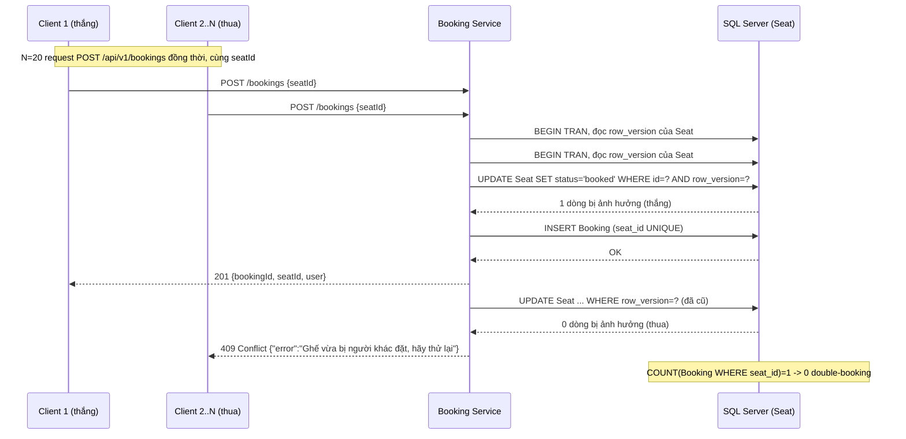

# 3. Xử lý đồng thời và Resilience

Mục này trình bày sợi chỉ đỏ kỹ thuật của đồ án: kịch bản tranh chấp "ghế cuối" khi nhiều khách cùng đặt một ghế tại cùng một thời điểm.
Kịch bản này nối ba chủ đề của Sommerville: nhất quán dữ liệu trong hệ phân tán (Chương 17), ngữ nghĩa lỗi của REST (Chương 18), và khả năng chịu lỗi/phục hồi (resilience, Chương 14).
Toàn bộ số liệu trong mục là số đo thật, bắt trực tiếp từ hệ thống đang chạy qua Docker (SQL Server + Booking Service) và bộ test tự động, không phải số minh hoạ.

## 3.1. Bài toán: race condition ghế cuối

Khi hai request đọc trạng thái một ghế gần như đồng thời, cả hai đều thấy ghế còn trống và cùng ghi đè "đã đặt".
Nếu không kiểm soát, hệ thống bán một ghế cho hai người, một lỗi *lost update* kinh điển của truy cập đồng thời (concurrent access) mà Sommerville xếp vào nhóm sự cố nhất quán trong hệ phân tán (Chương 17).
Trong nghiệp vụ đặt vé, đây không chỉ là bug kỹ thuật mà là một lỗi làm mất niềm tin của người dùng và có thể phát sinh trách nhiệm pháp lý.
Yêu cầu bất biến của hệ thống, phát biểu theo ngôn ngữ nghiệp vụ: **một ghế chỉ được bán cho tối đa một người, trong mọi tình huống đồng thời**.

## 3.2. Kiểm soát đồng thời bằng optimistic concurrency control

Có ba hướng xử lý tranh chấp: pessimistic locking (khoá dòng và bắt request khác chờ), queue-based serialization (xếp mọi thao tác vào một hàng đợi tuần tự), và optimistic concurrency control (cho các request chạy song song, chỉ phát hiện xung đột lúc ghi).
Chúng tôi chọn **optimistic concurrency control** (ADR-0001), phù hợp giả định của bài toán: xác suất hai người cùng nhắm đúng một ghế là thấp so với tổng lưu lượng, nên việc để các request chạy song song rồi phát hiện xung đột rẻ hơn là khoá phòng ngừa toàn cục.
Hướng này cũng cho phép service giữ tính **stateless** (Chương 17): không giữ khoá dài giữa các request, không phụ thuộc phiên, nên dễ nhân bản theo chiều ngang.

Cơ chế cụ thể dựa trên kiểu `ROWVERSION` native của SQL Server.
Mỗi hàng `Seat` mang một cột `row_version` được máy chủ tự động đổi giá trị sau mỗi lần cập nhật.
Thao tác đặt vé đọc `row_version` hiện tại của ghế, rồi cố cập nhật ghế thành "đã đặt" với điều kiện phiên bản chưa đổi:

```sql
UPDATE dbo.Seat
SET status = 'booked'
WHERE id = @seatId AND row_version = @rowVersion;
```

Nếu một request khác đã đặt ghế trong khoảng thời gian đó, `row_version` đã đổi, mệnh đề `WHERE` không khớp, và câu lệnh trả về **0 dòng bị ảnh hưởng**.
Đây chính là tín hiệu "tôi thua cuộc": request đó không ghi được gì và Booking Service trả về `409 Conflict`.
Việc đọc rồi ghi có điều kiện được đặt trong một **transaction** để cửa sổ kiểm tra và cập nhật là nguyên tử, tránh trạng thái trung gian bị request khác chen vào.

Ánh xạ sang REST (Chương 18): `409 Conflict` là mã trạng thái đúng ngữ nghĩa cho "yêu cầu hợp lệ nhưng mâu thuẫn với trạng thái tài nguyên hiện tại".
Đây là điểm giao của ba chương: cùng một sự kiện vừa là vấn đề nhất quán (Chương 17), vừa là mã lỗi REST (Chương 18), vừa là tình huống cho client thử lại (retry, Chương 14).

## 3.3. Hai tầng chống double-booking

Optimistic locking là tầng phòng thủ chính, nhưng chúng tôi bổ sung một tầng chốt chặn cuối độc lập: ràng buộc **UNIQUE trên `Booking.seat_id`**.
Kể cả trong tình huống cực đoan mà logic ứng dụng có sai sót và hai request cùng vượt qua bước `UPDATE`, việc chèn hai bản ghi `Booking` cho cùng một ghế sẽ bị chính cơ sở dữ liệu từ chối (lỗi SQL Server 2627/2601), và Booking Service dịch lỗi này thành `409` y hệt.
Đây là nguyên tắc **defence in depth**: một bất biến quan trọng được bảo vệ ở hai tầng bằng hai cơ chế khác nhau, để sai sót ở một tầng không dẫn tới vi phạm dữ liệu.
Optimistic lock cho câu trả lời nhanh và đúng ngữ nghĩa trong đường chạy bình thường; UNIQUE constraint là lời bảo đảm cứng ở tầng lưu trữ, không thể bị bỏ qua bởi bất kỳ đường code nào.

## 3.4. Bằng chứng thực nghiệm

Để chứng minh bất biến thực sự được giữ, bộ test `race.test.ts` bắn **20 request đồng thời** (qua `Promise.all`) cùng đặt một ghế test được tạo riêng.
Kết quả đo thật:

- Đúng **1 request trả `201`** (người thắng), **19 request trả `409`** (người thua).
- Truy vấn `SELECT COUNT(*) FROM Booking WHERE seat_id = @id` trả về **đúng 1**: không có double-booking.
- Toàn bộ 13 test của Booking Service pass trong **4.919 giây** (`npm test -w services/booking`), chạy trên SQL Server thật trong Docker.

Đây là bằng chứng thực nghiệm cho tính đúng đắn của optimistic concurrency control dưới tải tranh chấp, chứ không phải suy luận trên giấy.
Sơ đồ tuần tự của kịch bản này ở mục 3.7.

## 3.5. Resilience của lời gọi service-to-service

Chủ đề thứ hai của mục là khả năng chịu lỗi khi một service phụ trợ gặp sự cố (Chương 14).
Điểm resilience trong hệ thống nằm ở **service composition** (Chương 18): khi đặt vé thành công, Booking Service gọi `GET /api/v1/auth/users/me` của Auth Service để lấy hồ sơ người dùng (tên hiển thị, email) đính vào xác nhận đặt vé.
Đây là lời gọi service-to-service duy nhất trong luồng, và nó cố ý *không* nằm trên đường then chốt của nghiệp vụ: vé vẫn được giữ chỗ dù lời gọi này thất bại.

Lời gọi được bọc bằng thư viện `cockatiel` với bốn lớp phòng vệ xếp chồng (ADR-0002):

- **Timeout** 1.5 giây: cắt lời gọi treo, không để Booking Service chờ vô hạn khi Auth chậm.
- **Retry** tối đa 2 lần: hấp thụ lỗi thoáng qua (transient fault) như một cú mạng chập chờn.
- **Circuit breaker**: khi lỗi xảy ra 5 lần liên tiếp (`ConsecutiveBreaker`), breaker **mở** và các lời gọi tiếp theo bị chặn ngay lập tức mà không thử gọi mạng, tránh dồn thêm tải lên một service đang sập; sau một khoảng nghỉ, breaker chuyển sang trạng thái thử (half-open) để dò xem Auth đã hồi phục chưa.
- **Fallback**: khi mọi lớp trên đều thất bại, hàm trả về `user: null` thay vì ném lỗi.

Bốn lớp này là hiện thực cụ thể của các chiến lược resilience mà Sommerville nêu trong Chương 14: phát hiện lỗi (timeout), phục hồi lỗi (retry), và cô lập lỗi để tránh lan truyền (circuit breaker).

## 3.6. Graceful degradation và bằng chứng

Điểm mấu chốt về mặt dependability là: sự cố của Auth Service **không** kéo sập nghiệp vụ đặt vé.
Khi fallback kích hoạt, ghế vẫn được giữ chỗ và request vẫn trả `201`; xác nhận chỉ tạm thiếu tên hiển thị.
Đây là **graceful degradation** (suy giảm mềm, Chương 14): hệ thống mất một tính năng phụ (tên trên xác nhận) thay vì mất chức năng chính (giữ chỗ).

Xét theo lăng kính nhất quán (Chương 17): dữ liệu quan trọng (ghế đã bán cho ai) luôn giữ **strong consistency** qua optimistic lock trên một cơ sở dữ liệu; còn dữ liệu hiển thị phụ (tên người dùng) được phép **eventual consistency**, tức có thể tạm thiếu rồi bổ sung sau.
Việc phân loại đúng đâu là dữ liệu cần nhất quán mạnh và đâu là dữ liệu chấp nhận nhất quán lỏng chính là quyết định kiến trúc cho phép hệ thống vừa đúng đắn vừa bền bỉ.

Log có cấu trúc (structured logging bằng `pino`) ghi lại đủ ba trạng thái, bắt thật từ hệ thống đang chạy:

```json
{"level":30,...,"bookingId":20,"seatId":41,"userId":8,"coTenUser":true,"msg":"đặt vé thành công"}
{"level":40,...,"err":"fetch failed","msg":"fallback: không lấy được hồ sơ user từ Auth"}
{"level":30,...,"bookingId":21,"seatId":42,"userId":101,"coTenUser":false,"msg":"đặt vé thành công"}
{"level":40,...,"err":"Execution prevented because the circuit breaker is open","msg":"fallback: không lấy được hồ sơ user từ Auth"}
```

Bốn dòng này đọc như một câu chuyện: một booking đính được tên (`coTenUser:true`, đường composition bình thường); một lời gọi Auth thất bại (`fetch failed`); booking ngay sau đó vẫn thành công nhưng thiếu tên (`coTenUser:false`, đường fallback); và khi lỗi tích lũy, **circuit breaker đã mở** (`Execution prevented because the circuit breaker is open`) nên lời gọi kế bị chặn ngay mà booking vẫn thành công.
Đây là bằng chứng vận hành cho thấy cả bốn lớp resilience đều hoạt động thật, không chỉ tồn tại trong code.

Kiểm chứng ở biên HTTP: khi Auth hoạt động bình thường, body `201` mang hồ sơ thật `{"bookingId":24,"seatId":2,"user":{"displayName":"Demo Hugo","email":"demo1784017367@example.com"}}`, chứng tỏ composition chạy đúng chứ không phải luôn rơi vào fallback.

## 3.7. Sơ đồ tuần tự: race condition ghế cuối

Sơ đồ dưới mô tả N client cùng đặt một ghế; chỉ request đầu tiên thắng cuộc ở bước `UPDATE ... WHERE row_version` khớp, phần còn lại nhận 0 dòng bị ảnh hưởng và trả `409`.


